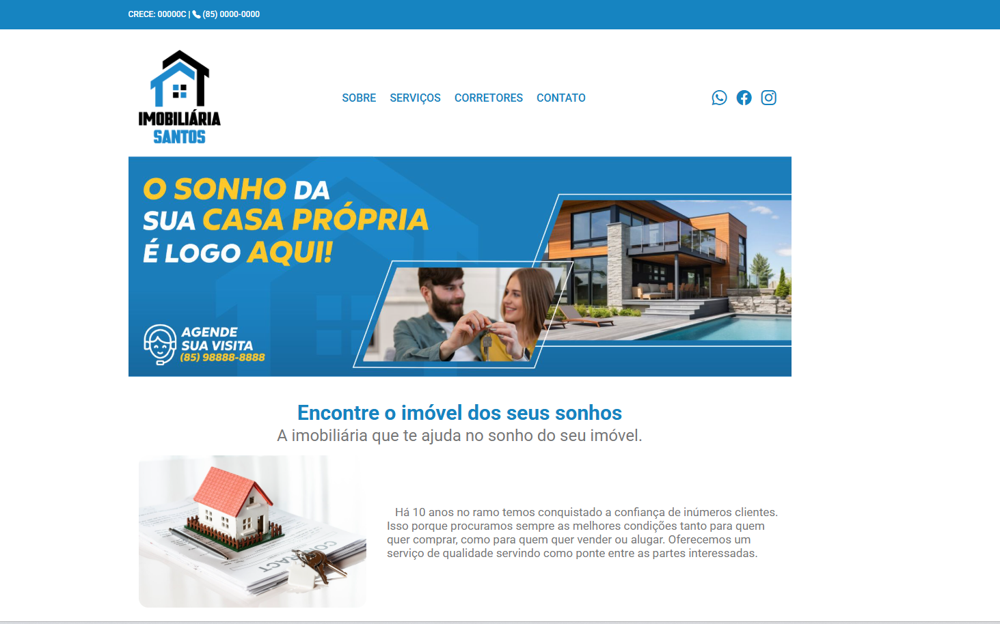
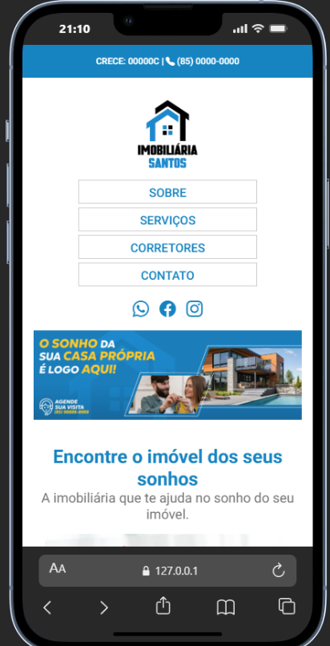

# 🏠 Imobiliária Santos - Landing Page Responsiva

Projeto institucional desenvolvido para o setor imobiliário, focado em alta performance e adaptabilidade total a diferentes dispositivos.

---

## 📸 Demonstração da Interface

### Visualização Desktop

| Banner Principal                | Localização e Mapa         |
| ------------------------------- | -------------------------- |
|  |  |

### Visualização Mobile 📱

Para garantir a melhor experiência em smartphones, o layout foi otimizado com Media Queries, ajustando menus, fontes e o grid de serviços.

  

---

## 🚀 Tecnologias e Conceitos Aplicados

- **HTML5 Semântico:** Uso de tags como `<header>`, `<nav>`, `<section>` e `<footer>` para melhor SEO e acessibilidade.
- **CSS3 Avançado:** - **Flexbox:** Para alinhamento dinâmico dos elementos.
  - **Responsividade:** Arquivo `responsivo.css` dedicado para tratar breakpoints.
- **JavaScript (Vanilla):** Script de rolagem suave (Smooth Scroll) para navegação entre âncoras.
- **Integração de APIs:** Iframe dinâmico do Google Maps e ícones via Bootstrap.

## 📱 Destaques do Desenvolvimento Responsivo

Como profissional com background em **Suporte Técnico**, prezo pela compatibilidade. Este projeto foi testado para:

1. **Layout Adaptativo:** O menu de navegação e as seções de "Sobre" e "Corretores" se empilham verticalmente em telas menores.
2. **Imagens Flexíveis:** Ajuste automático de escala para evitar transbordamento (overflow) lateral.
3. **Touch Friendly:** Botões e links com áreas de clique otimizadas para navegação por toque.

## 🔧 Como visualizar o projeto

1. Clone o repositório.
2. Abra o arquivo `index.html`.
3. Para testar a responsividade, pressione `F12` no navegador e alterne para o modo de visualização de dispositivos móveis.
